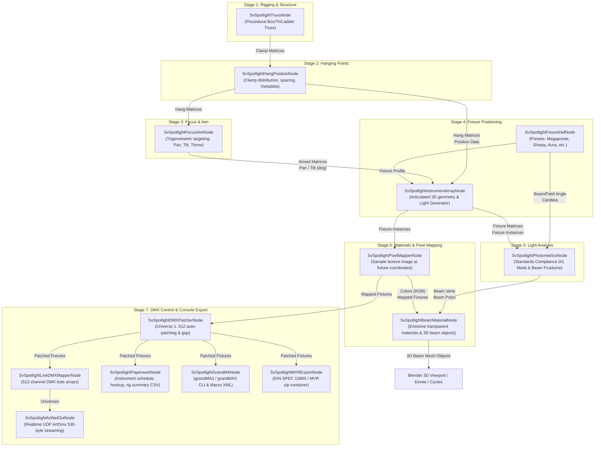

# Sverchok Spotlight Suite — Technical Specifications & System Architecture

> **Author**: Antigravity  
> **Target Version**: v1.3.0  
> **Host Environment**: Blender 4.2.x (Tested: 4.2.0) + Sverchok v1.4.0  
> **Repository Path**: `c:\_data\_esp32\New folder\sverchok_spotlight`  
> **Blender Addons Path**: `C:\Users\StudioDanielCanogar\AppData\Roaming\Blender Foundation\Blender\4.2\scripts\addons\sverchok_spotlight`  
> **Test Suite**: `sverchok_spotlight\test_spotlight_v2.py` (Exit Code 0, 100% Pass)

---

## 1. Executive Summary & Purpose

The **Sverchok Spotlight Suite** is a dedicated parametric entertainment lighting, stage rigging, photometric analysis, and DMX/Art-Net control add-on for Blender and Sverchok. It replicates and extends the complete feature set of **Vectorworks Spotlight**, **grandMA 3D**, and professional media server pixel mapping inside Blender's node-based visual programming environment.

The pipeline is built on **dedicated custom Sverchok nodes** (no generic SNLite scripts) conforming to a strict 5-stage sequential architecture with downstream control, media mapping, paperwork, and console export.

---

## 2. Complete System Pipeline Architecture



---

## 3. Node Catalog & Specifications (14 Custom Nodes)

### 3.1 Rigging Module (`nodes/rigging/`)

#### 1. `SvSpotlightTrussNode`
- **Class**: `SvSpotlightTrussNode` (`bpy.types.Node`, `SverchCustomTreeNode`)
- **Icon**: `MESH_CYLINDER` / `SV_CYLINDER`
- **Properties**:
  - `truss_type`: `EnumProperty` (`['BOX', 'TRIANGLE', 'LADDER']`)
  - `length`: `FloatProperty` (default `8.0m`)
  - `width`: `FloatProperty` (default `0.3m`)
  - `height`: `FloatProperty` (default `0.3m`)
  - `chord_diameter`: `FloatProperty` (default `0.05m`)
  - `lacing_diameter`: `FloatProperty` (default `0.02m`)
  - `lacing_bays`: `IntProperty` (default `8`)
  - `trim_height`: `FloatProperty` (default `6.0m`)
  - `orientation`: `FloatProperty` (rotation around Z in degrees)
- **Sockets**:
  - Inputs: `Length`, `Trim Height`, `Orientation`, `Matrix`
  - Outputs: `Vertices`, `Polygons`, `Centerline Verts`, `Centerline Edges`, `Clamp Matrices`

#### 2. `SvSpotlightHangPositionNode`
- **Class**: `SvSpotlightHangPositionNode` (`bpy.types.Node`, `SverchCustomTreeNode`)
- **Icon**: `SNAP_VERTEX` / `SV_TRANSFORM`
- **Properties**:
  - `position_name`: `StringProperty` (e.g., `"LX 1"`, `"FOH Truss A"`)
  - `distribution_mode`: `EnumProperty` (`['COUNT', 'SPACING']`)
  - `fixture_count`: `IntProperty` (default `6`)
  - `fixture_spacing`: `FloatProperty` (default `1.2m`)
  - `start_offset`: `FloatProperty` (default `0.5m`)
  - `mount_orientation`: `EnumProperty` (`['UNDERHUNG', 'OVERHUNG', 'SIDE_STAGE_LEFT', 'SIDE_STAGE_RIGHT']`)
- **Sockets**:
  - Inputs: `Matrix` (from Truss `Clamp Matrices`), `Fixture Count`, `Spacing`
  - Outputs: `Hang Matrices`, `Hang Points`, `Position Data` (metadata dictionaries)

---

### 3.2 Fixtures Module (`nodes/fixtures/`)

#### 3. `SvSpotlightFixtureDefNode`
- **Class**: `SvSpotlightFixtureDefNode` (`bpy.types.Node`, `SverchCustomTreeNode`)
- **Icon**: `LIGHT` / `SV_LAMP`
- **Properties**:
  - `preset_choice`: `EnumProperty` (`"Robe Robin MegaPointe"`, `"Clay Paky Sharpy"`, `"Martin MAC Aura"`, `"Chauvet Maverick MK3 Spot"`, `"Generic Profile"`, `"Generic LED Par"`, `"Custom"`)
  - `fixture_name`: `StringProperty`
  - `fixture_type`: `EnumProperty` (`['Moving Spot', 'Moving Wash', 'Moving Beam', 'Profile', 'Fresnel', 'LED Batten', 'Strobe']`)
  - `beam_angle`: `FloatProperty` (deg)
  - `field_angle`: `FloatProperty` (deg)
  - `candela`: `FloatProperty` (cd / peak intensity)
  - `wattage`: `FloatProperty` (W)
  - `weight_kg`: `FloatProperty` (kg)
  - `channel_count`: `IntProperty` (DMX channels)
  - `emitter_offset`: `FloatProperty` (distance from truss clamp base to front lens aperture along optical axis, default `0.36m`)
  - `lens_diameter`: `FloatProperty` (front lens aperture diameter, default `0.15m`)
  - `fixture_color`: `FloatVectorProperty` (RGB default color)
- **Sockets**:
  - Inputs: `Beam Angle`, `Field Angle`, `Candela`, `Wattage`, `Weight (kg)`, `Channels`, `Emitter Offset`, `Lens Diameter`
  - Outputs: `Fixture Profile`, `Beam Angle`, `Field Angle`, `Candela`, `Wattage`, `Weight (kg)`, `Channels`, `Emitter Offset`, `Lens Diameter`

#### 4. `SvSpotlightInstrumentArrayNode`
- **Class**: `SvSpotlightInstrumentArrayNode` (`bpy.types.Node`, `SverchCustomTreeNode`)
- **Icon**: `GROUP` / `SV_MESH_GEN`
- **Properties**:
  - `unit_start_number`: `IntProperty` (default `1`)
  - `generate_symbols`: `BoolProperty` (default `True`)
  - `clamp_geometry`: `BoolProperty` (default `True`)
  - `yoke_geometry`: `BoolProperty` (default `True`)
  - `head_geometry`: `BoolProperty` (default `True`)
- **Articulated Kinematics**:
  - Clamp Base: fixed at truss pipe bottom ($Z = z_{\text{clamp}}$)
  - Yoke Arms: articulated around vertical $Z$ by `Pan (deg)`
  - Head Cylinder: articulated around horizontal trunnion axis by `Tilt (deg)`
  - Light Generator ($P_{\text{emitter}}$): articulated 3D front lens position:
    $$P_{\text{emitter}} = M_{\text{hang}} \cdot T(0, 0, -z_{\text{base}}) \cdot R_z(\text{pan}) \cdot R_x(\text{tilt}) \cdot \begin{bmatrix}0 \\ 0 \\ -\text{emitter\_offset} \\ 1\end{bmatrix}$$
- **Sockets**:
  - Inputs: `Hang Matrices`, `Position Data`, `Aimed Matrices`, `Pan (deg)`, `Tilt (deg)`, `Fixture Profile`, `Start Unit`
  - Outputs: `Fixture Instances`, `Vertices`, `Polygons`, `Fixture Matrices`, `Emitter Matrices`, `Emitter Points`

---

### 3.3 Focus Module (`nodes/focus/`)

#### 5. `SvSpotlightFocusAimNode`
- **Class**: `SvSpotlightFocusAimNode` (`bpy.types.Node`, `SverchCustomTreeNode`)
- **Icon**: `TRACKING` / `SV_TRACK_TO`
- **Properties**:
  - `aim_mode`: `EnumProperty` (`['TARGET_POINT', 'EULER_ANGLES', 'FOCUS_PALETTE']`)
  - `default_focus_target`: `FloatVectorProperty` (default `(0.0, 0.0, 0.0)`)
  - `pan_range_deg`: `FloatProperty` (default `540.0`, span $\pm 270^\circ$)
  - `tilt_range_deg`: `FloatProperty` (default `270.0`, span $\pm 135^\circ$)
- **Trigonometric Solver**:
  - Transforms target point into local coordinate system of fixture clamp
  - $\text{Pan} = \text{atan2}(v_y, v_x)$
  - $\text{Tilt} = \text{atan2}(\sqrt{v_x^2 + v_y^2}, -v_z)$
  - $\text{Throw} = \sqrt{v_x^2 + v_y^2 + v_z^2}$
- **Sockets**:
  - Inputs: `Hang Matrices`, `Target Points`, `Target Vector`, `Focus X/Y/Z`
  - Outputs: `Aimed Matrices`, `Pan (deg)`, `Tilt (deg)`, `Throw (m)`, `Aim Vectors`

---

### 3.4 Photometrics & Materials Module (`nodes/photometrics/`)

#### 6. `SvSpotlightPhotometricsNode`
- **Class**: `SvSpotlightPhotometricsNode` (`bpy.types.Node`, `SverchCustomTreeNode`)
- **Icon**: `CONE` / `SV_COLOR_RAMP`
- **Properties**:
  - `standard_preset`: `EnumProperty` (`['STAGE_500', 'BROADCAST_1000', 'CONCERT_750', 'MUSEUM_300', 'REHEARSAL_200', 'CUSTOM']`)
  - `min_lux_threshold`: `FloatProperty` (default `500.0 lx`)
  - `floor_z`: `FloatProperty` (default `0.0m`)
  - `show_beam`: `BoolProperty` (50% intensity cone)
  - `show_field`: `BoolProperty` (10% intensity cone)
  - `segments`: `IntProperty` (default `16`)
  - `max_cone_length`: `FloatProperty` (default `20.0m`)
- **Beam Frustum Generation**:
  - Originates strictly at the front lens aperture ($P_{\text{emitter}}$) with initial apex ring radius matching `lens_diameter * 0.5`. Verified distance from cone apex to emitter: **$0.0000\text{m}$**.
- **Outputs**:
  - `Compliance Mask`: Boolean/binary array (`[0, 1, 1, 0, ...]`), `0` = insufficient lux, `1` = compliant.
  - `Compliance Status`: Summary string (`"4/4 Pass (>= 500 lx)"`).
  - `Lux`: Numeric illuminance values per fixture.
  - `Footprint Size`: Floor ellipse dimensions (`"2.45m x 3.10m"`).
  - `Beam Verts`, `Beam Polys`, `Field Verts`, `Field Polys`: 3D frustum mesh geometry.
  - `Footprint Verts`, `Footprint Edges`: 2D stage floor ellipse outlines.

#### 7. `SvSpotlightBeamMaterialNode` *(NEW)*
- **Class**: `SvSpotlightBeamMaterialNode` (`bpy.types.Node`, `SverchCustomTreeNode`)
- **Icon**: `MATERIAL` / `SV_COLOR_ROUGHNESS`
- **Properties**:
  - `material_prefix`: `StringProperty` (default `"Spotlight_Beam"`)
  - `emission_strength`: `FloatProperty` (default `5.0`, core glow)
  - `beam_alpha`: `FloatProperty` (default `0.25`, volumetric atmospheric dust look)
  - `color_source`: `EnumProperty` (`['AUTO', 'FIXTURES', 'COLORS', 'GLOBAL']`)
  - `global_color`: `FloatVectorProperty` (RGB override)
  - `auto_create_objects`: `BoolProperty` (creates/updates 3D beam mesh objects in scene)
  - `collection_name`: `StringProperty` (default `"Spotlight_Beams"`)
- **Shader Pipeline**:
  - `ShaderNodeEmission` (Color: $R \cdot \text{dim}, G \cdot \text{dim}, B \cdot \text{dim}$, Strength: `emission_strength`)
  - `ShaderNodeBsdfTransparent` (Color: `1.0, 1.0, 1.0`)
  - `ShaderNodeAddShader` (Blends emission with transparency)
  - `diffuse_color`: $(R \cdot \text{dim}, G \cdot \text{dim}, B \cdot \text{dim}, \alpha)$ for Solid viewport display
  - Eevee Next & Cycles: `surface_render_method = 'BLENDED'`, `blend_method = 'BLEND'`, `shadow_method = 'NONE'`
- **Sockets**:
  - Inputs: `Beam Verts`, `Beam Polys`, `Colors`, `Fixture Instances`, `Objects`, `Emission Strength`, `Beam Alpha`
  - Outputs: `Materials`, `Material Names`, `Colors (RGB)`, `Objects`, `Material Indices`, `Summary`

---

### 3.5 DMX & Control Module (`nodes/dmx/`)

#### 8. `SvSpotlightDMXPatcherNode`
- **Class**: `SvSpotlightDMXPatcherNode` (`bpy.types.Node`, `SverchCustomTreeNode`)
- **Properties**: `start_universe` (`1..256`), `start_address` (`1..512`), `channel_start`, `address_gap`, `auto_next_universe` (wraps past 512)
- **Sockets**:
  - Inputs: `Fixtures`, `Start Universe`, `Start Address`
  - Outputs: `Patched Fixtures`, `Patch Table`, `Universe Summary`, `Warnings`

#### 9. `SvSpotlightPixelMapperNode` *(NEW)*
- **Class**: `SvSpotlightPixelMapperNode` (`bpy.types.Node`, `SverchCustomTreeNode`)
- **Icon**: `IMAGE_RGB` / `SV_COLOR_MIX`
- **Properties**:
  - `image_path`: `StringProperty` (disk path: `.png`, `.jpg`, `.exr`, `.bmp`, `.hdr`)
  - `image_name`: `StringProperty` (Blender image datablock)
  - `mapping_plane`: `EnumProperty` (`['XY', 'XZ', 'YZ', 'UV']`)
  - `bounds_mode`: `EnumProperty` (`['AUTO', 'CUSTOM']`)
  - `min_u_bound`, `max_u_bound`, `min_v_bound`, `max_v_bound`: `FloatProperty` (meters)
  - `padding`: `FloatProperty` (default `0.05`)
  - `flip_x`, `flip_y`: `BoolProperty`
  - `master_dimmer`: `FloatProperty` (default `1.0`)
  - `filter_mode`: `EnumProperty` (`['BILINEAR', 'NEAREST']`)
- **Bilinear Sampling Formulation**:
  $$C(u, v) = (1-f_x)(1-f_y)C_{00} + f_x(1-f_y)C_{10} + (1-f_x)f_y C_{01} + f_x f_y C_{11}$$
  $$\text{Luminance } L = 0.2126R + 0.7152G + 0.0722B$$
- **Sockets**:
  - Inputs: `Fixtures`, `Points`, `Image Path`, `UVs`, `Master Dimmer`
  - Outputs: `Mapped Fixtures`, `Colors (RGB)`, `Colors (RGBA)`, `Hex Colors`, `Dimmers`, `UV Coordinates`, `Summary`

#### 10. `SvSpotlightLiveDMXMapperNode`
- **Class**: `SvSpotlightLiveDMXMapperNode` (`bpy.types.Node`, `SverchCustomTreeNode`)
- **Properties**: `master_dimmer`, `strobe_val`, `override_color`, `global_color`
- **Robust Color Parsing**: Handles color names (`"open white"` $\to$ `(1.0, 1.0, 1.0)`, `"amber"`, `"cyan"`, etc.), hex strings (`"#RRGGBB"`), and numeric RGB tuples.
- **Sockets**:
  - Inputs: `Fixtures`, `Master Dimmer`, `Strobe`, `Global Color`
  - Outputs: `Universes` (Dict `{1: [512], ...}`), `Universe 1`, `DMX Matrix`, `Summary`

#### 11. `SvSpotlightArtNetOutNode`
- **Class**: `SvSpotlightArtNetOutNode` (`bpy.types.Node`, `SverchCustomTreeNode`)
- **Properties**: `target_ip` (`"127.0.0.1"` or broadcast `"255.255.255.255"`), `target_port` (`6454`), `subnet`, `net`, `broadcast_mode`
- **Packet Structure**: Exact 530-byte `ArtDmx` specification:
  - Header: `b"Art-Net\x00"` (8 bytes)
  - OpCode: `0x5000` (little-endian `0x00, 0x50`, 2 bytes)
  - Protocol Version: `14` (high byte `0`, low byte `14`, 2 bytes)
  - Sequence: `0..255` (1 byte)
  - Physical: `0` (1 byte)
  - SubUni / Net: 2 bytes
  - Length: `512` (big-endian `0x02, 0x00`, 2 bytes)
  - DMX Data: 512 bytes ($0..255$)
- **Sockets**:
  - Inputs: `Universes`, `Target IP`, `Send Trigger`
  - Outputs: `Status`, `Packet Count`, `Byte Stream`

#### 12. `SvSpotlightPaperworkNode`
- **Class**: `SvSpotlightPaperworkNode` (`bpy.types.Node`, `SverchCustomTreeNode`)
- **Properties**:
  - `report_type`: `['INSTRUMENT_SCHEDULE', 'CHANNEL_HOOKUP', 'RIG_SUMMARY']`
  - `export_path`: `StringProperty` (`"//lighting_schedule.csv"`)
- **Sockets**:
  - Inputs: `Patched Fixtures`
  - Outputs: `Report Text`, `Total Weight (kg)`, `Total Power (kW)`, `Current 230V (A)`, `Current 120V (A)`

---

### 3.6 Exchange & Export Module (`nodes/exchange/`)

#### 13. `SvSpotlightMVRExportNode`
- **Class**: `SvSpotlightMVRExportNode` (`bpy.types.Node`, `SverchCustomTreeNode`)
- **Properties**: `file_path` (`"//stage_lighting_rig.mvr"`), `scene_name`, `provider`
- **Structure**: Generates valid DIN SPEC 15800 MVR ZIP container containing `GeneralSceneDescription.xml` with 3D coordinate matrices, layer hierarchies, fixture addresses, and channel assignments.
- **Sockets**:
  - Inputs: `Fixtures`, `File Path`
  - Outputs: `File Path`, `XML Text`, `Status`

#### 14. `SvSpotlightGrandMANode`
- **Class**: `SvSpotlightGrandMANode` (`bpy.types.Node`, `SverchCustomTreeNode`)
- **Properties**:
  - `export_format`: `['MA3_CLI', 'MA3_XML', 'MA2_CLI', 'MA2_XML']`
  - `file_path`: `StringProperty` (`"//grandma_patch.txt"`)
  - `create_blender_text`: `BoolProperty`
- **Robust Coordinate Parsing**: Supports string position names (`fix['position'] = "FOH Truss A"`) by extracting 3D coords from `world_pos` / `clamp_pos` without formatting exceptions.
- **Sockets**:
  - Inputs: `Fixtures`, `File Path`
  - Outputs: `Script Text`, `File Path`, `Status`

---

## 4. Key Data Contracts & Socket Schemas

### 4.1 `Fixture Instances` / `Mapped Fixtures` Dictionary Schema
Every fixture circulating in the pipeline is a Python dictionary with standard keys:
```python
{
    "unit_number": 1,                     # int (1-based Unit ID)
    "fixture_name": "MegaPointe 1",       # str
    "fixture_type": "Moving Spot",        # str
    "position": "LX 1",                   # str (Position name)
    "position_index": 0,                  # int (Index along position)
    "world_pos": [-4.508, 0.0, 5.531],    # [float, float, float] (Articulated front lens)
    "clamp_pos": [-4.400, 0.0, 5.855],    # [float, float, float] (Truss clamp base)
    "emitter_pos": [-4.508, 0.0, 5.531],  # [float, float, float] (Light generator origin)
    "emitter_offset": 0.36,               # float (meters)
    "lens_diameter": 0.15,                # float (meters)
    "pan": 90.0,                          # float (degrees)
    "tilt": 36.92,                        # float (degrees)
    "throw": 7.324,                       # float (meters)
    "aim_vector": [0.601, 0.0, -0.799],   # [float, float, float]
    "beam_angle": 15.0,                   # float (degrees)
    "field_angle": 25.0,                  # float (degrees)
    "candela": 350000.0,                  # float (cd)
    "wattage": 470.0,                     # float (W)
    "weight_kg": 22.0,                    # float (kg)
    "channel_count": 39,                  # int (DMX channels)
    "universe": 1,                        # int (1-based DMX universe)
    "address": 1,                         # int (1-based DMX address 1..512)
    "dimmer": 1.0,                        # float (0.0 to 1.0)
    "color": (1.0, 0.0, 0.5),             # (float, float, float) RGB in 0..1
    "color_rgba": (1.0, 0.0, 0.5, 1.0),   # (float, float, float, float)
    "color_hex": "#FF007F",               # str hex
    "pixel_uv": (0.25, 0.75),             # (float, float) mapped texture UV
}
```

### 4.2 Matrix Standards
- **Coordinate System**: Right-handed, $Z$-up, metric ($1.0 = 1.0\text{m}$).
- **Truss Clamp Matrix**: Transforms $(0, 0, 0)$ to the bottom center of the truss chord pipe.
- **Articulated Fixture Matrix**: Transforms head coordinates such that the optical axis points along $-Z$ (or local aim forward), terminating at $Z = -\text{emitter\_offset}$.

---

## 5. Critical Blender & Sverchok Implementation Rules & Gotchas

1. **Sverchok Socket Caching & Evaluation**:
   - In Sverchok, calling `output_socket.sv_get()` inside a headless script raises `SvNoDataError` unless `output_socket.is_linked == True`.
   - Sverchok only retains/caches socket data for linked outputs.
   - When unit testing Sverchok nodes outside GUI, dummy receiver nodes or active links must connect from output to input, and data must be set on both `output.sv_set(...)` and `input.sv_set(...)`.

2. **Blender Headless (`blender -b`) Operator Crash Bug**:
   - Operators defined with `bl_options = {'REGISTER', 'UNDO'}` cause an `EXCEPTION_ACCESS_VIOLATION` in `Header_bl_idname_length` when called via Python script in headless mode (`-b`), because Blender attempts to record an undo step into a null Header/Window pointer.
   - **Fix**: All custom utility operators (`SV_OT_SpotlightCreateSampleRig`, `SV_OT_SpotlightReload`, `SV_OT_SpotlightGrandMAExport`) MUST use `bl_options = {'REGISTER'}` without `'UNDO'`.

3. **Subprocess Working Directory Rule**:
   - When invoking Blender via CLI runner in PowerShell:
     ```powershell
     & "C:\Program Files\Blender Foundation\Blender 4.2\blender.exe" -b --python "sverchok_spotlight\test_spotlight_v2.py"
     ```
   - The current working directory (`Cwd`) MUST be `"c:\_data\_esp32\New folder"`.
   - **DO NOT** use `Cwd: "c:\_data\_esp32\New folder\sverchok_spotlight"`, because the CLI runner resolves `powershell` by checking `<Cwd>\powershell.cmd`, which intercepts the command with a PlatformIO wrapper.

4. **Third-Party Addon Teardown Crash (`mega-polis-main`)**:
   - An unrelated third-party addon `mega-polis-main` in the user's AppData raises an `AttributeError` on `SV_PT_SverchokUtilsPanel` if Blender exits naturally while Sverchok is disabled during teardown.
   - In standalone test scripts, call `sys.stdout.flush(); sys.stderr.flush(); os._exit(0)` at the end of the test to ensure clean exit code 0.

5. **Codebase Synchronization**:
   - The user runs Blender directly against the AppData addon directory:
     `C:\Users\StudioDanielCanogar\AppData\Roaming\Blender Foundation\Blender\4.2\scripts\addons\sverchok_spotlight`
   - The git repository workspace is:
     `c:\_data\_esp32\New folder\sverchok_spotlight`
   - Both locations MUST be kept 100% mirrored whenever any file is edited using Robocopy:
     ```powershell
     robocopy "c:\_data\_esp32\New folder\sverchok_spotlight" "$env:APPDATA\Blender Foundation\Blender\4.2\scripts\addons\sverchok_spotlight" /MIR /XD __pycache__ .git
     ```

---

## 6. Verification Test Suite (`test_spotlight_v2.py`)

Run command:
```powershell
& "C:\Program Files\Blender Foundation\Blender 4.2\blender.exe" -b --python "sverchok_spotlight\test_spotlight_v2.py"
```

### Verification Benchmarks Passed:
- [x] Addons enabled (`sverchok`, `sverchok_spotlight`)
- [x] Category menu verified in Sverchok Add menu (`Spotlight`)
- [x] All 14 custom nodes instantiated successfully
- [x] Stage 1 (Truss): Generated clamp matrices
- [x] Stage 2 (Hanging Points): Generated 4 hanging positions and points
- [x] Stage 3 (Focus Aim): Calculated Pan $[90^\circ, 90^\circ, -90^\circ, -90^\circ]$, Tilt $[36.92^\circ, 19.44^\circ, 2.61^\circ, 23.94^\circ]$, Throw $[7.324, 6.209, 5.861, 6.406]\text{m}$
- [x] Stage 4 (Fixture Positioning): Generated 160 articulated verts, pan=$90^\circ$, tilt=$36.92^\circ$
- [x] Stage 4 (Light Generator): Clamp pos $Z=5.855\text{m}$, Emitter pos $Z=5.531\text{m}$
- [x] Stage 5 (Light Analysis): Lux $[36746.4, 60868.0, 72628.2, 55314.6]$, Compliance Mask $[1, 1, 1, 1]$
- [x] Light Generator Beam Origin: Beam cone origin matches front lens ($5.531\text{m}$) instead of clamp ($5.855\text{m}$), distance error = **$0.0000\text{m}$**
- [x] Stage 5 (Threshold Check): Strict 1,000,000 lx yielded $[0, 0, 0, 0]$
- [x] Live DMX Mapper: Handled `"Open White"` and hex color strings without `TypeError`
- [x] grandMA Export: Handled string positions without `ValueError`
- [x] Pixel Mapper: Bilinear & nearest sampling on test image yielded exact sampled colors and UVs
- [x] Beam Material: Created 4 emissive/transparent materials with `ShaderNodeEmission` + `ShaderNodeBsdfTransparent` and assigned to 3D beam mesh objects in `"Test_Spotlight_Beams"`
- [x] Demo Rig Operator: Created complete 14-node rig with 24 links
- [x] Art-Net Streaming: Validated 530-byte UDP `ArtDmx` packet with valid header
- [x] Dynamic Reload Operator: Unregistered and re-registered entire suite cleanly
- [x] **Exit Code**: **`0`**

---

## 7. File Manifest & Structure

```
c:\_data\_esp32\New folder\sverchok_spotlight\
├── __init__.py                 # Addon registration, menus, Demo Rig & Reload operators
├── SPECIFICATIONS.md           # This comprehensive architecture & technical reference
├── test_spotlight_v2.py        # Automated 14-node integration test suite (Exit Code 0)
├── nodes/
│   ├── __init__.py             # Subpackage registration hub
│   ├── rigging/
│   │   ├── __init__.py
│   │   ├── truss_gen.py        # SvSpotlightTrussNode
│   │   └── hang_position.py    # SvSpotlightHangPositionNode
│   ├── fixtures/
│   │   ├── __init__.py
│   │   ├── fixture_def.py      # SvSpotlightFixtureDefNode
│   │   └── instrument_array.py # SvSpotlightInstrumentArrayNode
│   ├── focus/
│   │   ├── __init__.py
│   │   └── focus_aim.py        # SvSpotlightFocusAimNode
│   ├── photometrics/
│   │   ├── __init__.py
│   │   ├── photometrics.py     # SvSpotlightPhotometricsNode
│   │   └── beam_material.py    # SvSpotlightBeamMaterialNode (Shader & volumetric beams)
│   ├── dmx/
│   │   ├── __init__.py
│   │   ├── dmx_patcher.py      # SvSpotlightDMXPatcherNode
│   │   ├── pixel_mapper.py     # SvSpotlightPixelMapperNode (Texture image to colors)
│   │   ├── live_dmx_mapper.py  # SvSpotlightLiveDMXMapperNode
│   │   ├── artnet_out.py       # SvSpotlightArtNetOutNode
│   │   └── paperwork.py        # SvSpotlightPaperworkNode
│   └── exchange/
│       ├── __init__.py
│       ├── mvr_export.py       # SvSpotlightMVRExportNode
│       └── grandma_export.py   # SvSpotlightGrandMANode
└── utils/
    ├── __init__.py
    ├── lighting_math.py        # Trigonometry, frustum meshes, footprint calculation
    └── presets.py              # Fixture specifications library & standards thresholds
```

---

## 8. Suggested Future Developments

1. **GDTF Native Import**: Parse `.gdtf` archives (General Device Type Format XML + 3D meshes) directly into `SvSpotlightFixtureDefNode`.
2. **sACN (E1.31) Output**: Add an `SvSpotlightsACNOutNode` mirroring the Art-Net streamer for multicast streaming ACN.
3. **Animated / Video Texture Player**: Allow `SvSpotlightPixelMapperNode` to evaluate animated image sequences or video clips on frame change handlers (`bpy.app.handlers.frame_change_post`).
4. **Gobofiles & Texture Projection**: Support projecting grayscale/colored gobo textures through the beam frustums onto the stage floor.
